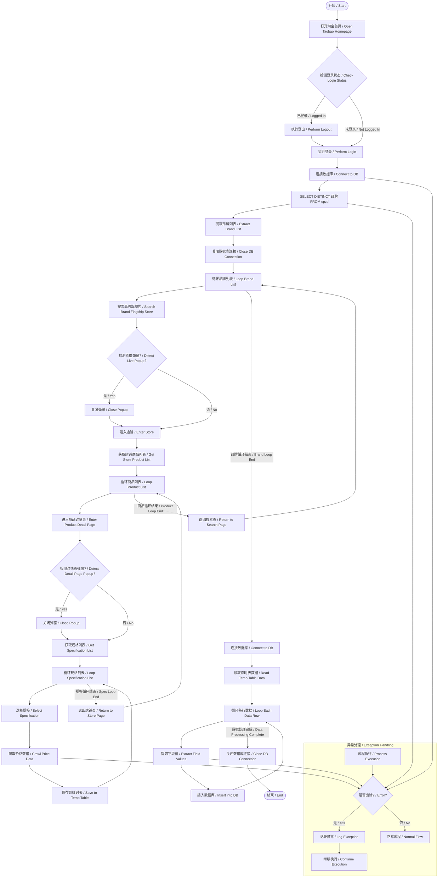
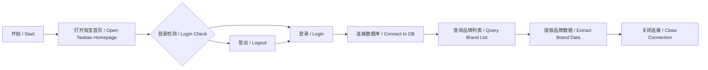
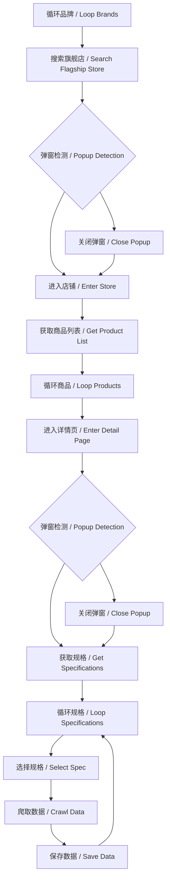
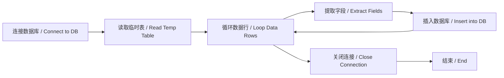
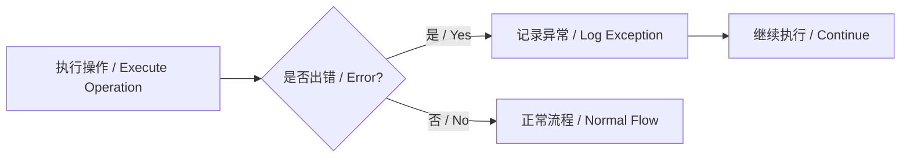

# 淘宝天猫商品信息爬取RPA机器人 / Taobao Tmall Product Information Crawling RPA Robot
*自动化商品信息爬取工具 - 为企业采购决策提供数据支持 / Automated Product Information Crawling Tool - Providing Data Support for Enterprise Procurement Decisions*

## 项目概述 / Project Overview

此RPA机器人使用**实在智能RPA平台**开发，专门用于爬取淘宝天猫平台的商品信息。通过与企业内部商品价格数据进行对比分析，为企业采购提供价格参考和选品建议。
This RPA robot is developed using the **Real Intelligence RPA Platform** and is specifically designed to crawl product information from the Taobao and Tmall platforms. By comparing and analyzing the data against internal enterprise product price data, it provides price references and product selection suggestions for procurement.

### 爬取数据字段 / Data Fields Crawled
| 字段名<br>Field Name | 说明<br>Description | 字段名<br>Field Name | 说明<br>Description |
|----------|--------------|--------|------------|
| qdpt     | 渠道平台<br>Sales Channel Platform | sj     | 售价<br>Selling Price |
| pp       | 品牌<br>Brand | yj     | 原价<br>Original Price |
| lb       | 类别<br>Category | xsl    | 销售量<br>Sales Volume |
| spmc     | 商品名称<br>Product Name | pjs    | 评价数<br>Number of Reviews |
| gg       | 规格<br>Specifications | dw     | 单位<br>Unit |

## 技术特点 / Technical Features

### 反爬策略解决方案 / Anti-Crawling Strategy Solutions
- ✅ 已解决直播窗口突然弹出的干扰问题 /  Resolved interference from sudden pop-up live stream windows
- ✅ 已处理界面按钮位置偏移的识别问题 /  Addressed the issue of identifying UI buttons with positional offsets
- ✅ 针对特殊页面设计：无法识别的元素默认设为0，确保流程持续执行 / Designed for special pages: Unrecognizable elements are defaulted to 0 to ensure process continuity

## 工作流程 / Workflow
# 淘宝天猫商品爬取RPA流程图 / Taobao Tmall Product Crawling RPA Flowchart




## 流程图说明 / Flowchart Explanation

### 1. 初始化阶段 / Initialization Phase



### 2. 爬取主循环 / Main Crawling Loop



### 3. 数据存储阶段 / Data Storage Phase



### 4. 异常处理机制 / Exception Handling Mechanism



## 技术要点说明 / Key Technical Points

1.  **三层循环结构 / Three-Layer Loop Structure**：
    -   外层：品牌循环（从数据库获取） / Outer: Brand loop (from database)
    -   中层：商品循环（店铺页面） / Middle: Product loop (store page)
    -   内层：规格循环（商品详情页） / Inner: Specification loop (product detail page)

2.  **弹窗处理机制 / Popup Handling Mechanism**：
    -   直播弹窗检测 / Live stream popup detection
    -   详情页弹窗检测 / Detail page popup detection
    -   位置偏移容错处理 / Position offset fault tolerance

3.  **数据流设计 / Data Flow Design**：
    ```mermaid
    graph LR
        DB1[(cj_rw_spzd表 / Table)] -->|品牌数据 / Brand Data| RPA
        RPA -->|临时数据 / Temp Data| DataFrame
        DataFrame -->|最终数据 / Final Data| DB2[(cj_rw_spxx表 / Table)]
    ```

4.  **关键SQL操作 / Key SQL Operations**：
    ```sql
    -- 获取品牌列表 / Get brand list
    SELECT DISTINCT spmc FROM cj_rw_spzd;
    
    -- 插入爬取数据 / Insert crawled data
    INSERT INTO cj_rw_spxx (qdpt,pp,lb,spmc,gg,dw,sj,yj,xsl,pjs,rq,sj)
    VALUES (@qdpt, @pp,@lb, @spmc, @gg, @dw,@sj, @yj, @xsl, @pjs,CONVERT(varchar(100), GETDATE(), 23),CONVERT(varchar(100), GETDATE(), 108));
    ```

## 使用说明 / Usage Instructions

1.  **环境准备 / Environment Setup**：
    -   安装实在智能RPA平台 / Install Real Intelligence RPA Platform
    -   Chrome浏览器（最新版） / Chrome Browser (Latest Version)
    -   Python 3.8+ 环境 / Python 3.8+ Environment

2.  **运行机器人 / Run the Robot**：
    -   在实在智能RPA平台导入项目 / Import the project in the Real Intelligence RPA Platform
    -   配置数据库连接参数 / Configure database connection parameters
    -   执行主流程文件 / Execute the main process file

## 注意事项 / Important Notes

1.  请遵守淘宝天猫平台的爬虫协议 / Please comply with the crawling policies of Taobao and Tmall platforms.
2.  合理设置爬取间隔，避免对目标网站造成过大压力 / Set reasonable crawling intervals to avoid excessive pressure on the target website.
3.  定期更新元素定位器，以应对网站改版 / Regularly update element selectors to adapt to website redesigns.
4.  敏感信息（如数据库凭证）请使用环境变量管理 / Manage sensitive information (e.g., database credentials) using environment variables.

## 维护与支持 / Maintenance & Support

如遇问题，请提交Issue或联系： / If you encounter any problems, please submit an Issue or contact:
-   维护者：smytz6@163.com / Maintainer: smytz6@163.com
-   最后更新时间：2025-8-24 / Last Updated: 2025-8-24

---
