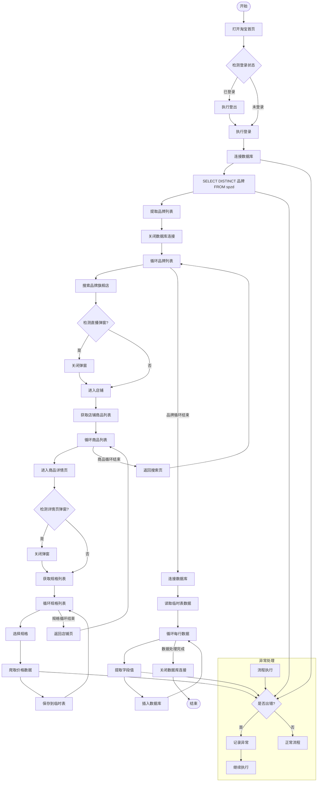
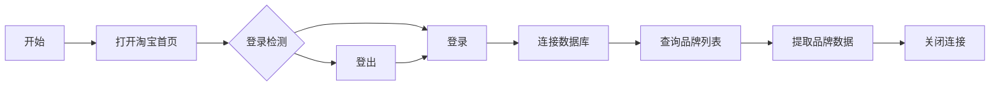
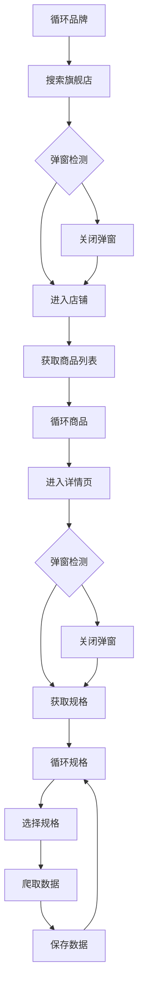
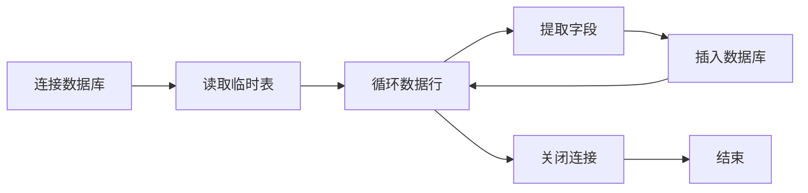
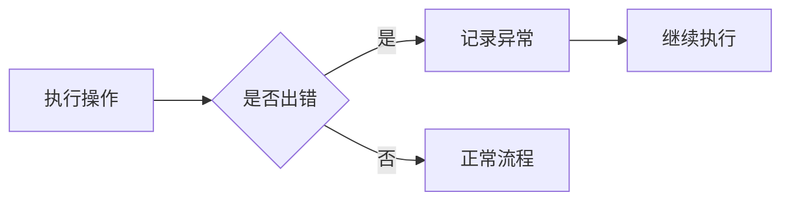

# 2025-platform-price-crawling-tool

# 淘宝天猫商品信息爬取RPA机器人
*自动化商品信息爬取工具 - 为企业采购决策提供数据支持*

## 项目概述

此RPA机器人使用**实在智能RPA平台**开发，专门用于爬取淘宝天猫平台的商品信息。通过与企业内部商品价格数据进行对比分析，为企业采购提供价格参考和选品建议。

### 爬取数据字段
| 字段名   | 说明         | 字段名 | 说明       |
|----------|--------------|--------|------------|
| qdpt     | 渠道平台     | sj     | 售价       |
| pp       | 品牌         | yj     | 原价       |
| lb       | 类别         | xsl    | 销售量     |
| spmc     | 商品名称     | pjs    | 评价数     |
| gg       | 规格         | dw     | 单位       |

## 技术特点

### 反爬策略解决方案
- ✅ 已解决直播窗口突然弹出的干扰问题
- ✅ 已处理界面按钮位置偏移的识别问题
- ✅ 针对特殊页面设计：无法识别的元素默认设为0，确保流程持续执行

### 异常处理机制
```python
try:
    # 正常爬取逻辑
except Exception as ex:
    异常对象 = SZEnv['rpa'].format_ex(ex)
    Basic.DebugOutput(SZEnv['rpa'], 异常对象)  
    continue  # 跳过当前异常继续执行
```

## 工作流程
# 淘宝天猫商品爬取RPA流程图

下面是使用Mermaid语法绘制的完整流程图：



## 流程图说明

### 1. 初始化阶段


### 2. 爬取主循环


### 3. 数据存储阶段


### 4. 异常处理机制


## 技术要点说明

1. **三层循环结构**：
   - 外层：品牌循环（从数据库获取）
   - 中层：商品循环（店铺页面）
   - 内层：规格循环（商品详情页）

2. **弹窗处理机制**：
   - 直播弹窗检测
   - 详情页弹窗检测
   - 位置偏移容错处理

3. **数据流设计**：
   ```mermaid
   graph LR
       DB1[(cj_rw_spzd表)] -->|品牌数据| RPA
       RPA -->|临时数据| DataFrame
       DataFrame -->|最终数据| DB2[(cj_rw_spxx表)]
   ```

4. **关键SQL操作**：
   ```sql
   -- 获取品牌列表
   SELECT DISTINCT spmc FROM cj_rw_spzd;
   
   -- 插入爬取数据
   INSERT INTO cj_rw_spxx (qdpt,pp,lb,spmc,gg,dw,sj,yj,xsl,pjs,rq,sj)
   VALUES (@qdpt, @pp,@lb, @spmc, @gg, @dw,@sj, @yj, @xsl, @pjs,CONVERT(varchar(100), GETDATE(), 23),CONVERT(varchar(100), GETDATE(), 108));
   ```


## 使用说明

1. **环境准备**：
   - 安装实在智能RPA平台
   - Chrome浏览器（最新版）
   - Python 3.8+ 环境

2. **运行机器人**：
   - 在实在智能RPA平台导入项目
   - 配置数据库连接参数
   - 执行主流程文件

## 注意事项

1. 请遵守淘宝天猫平台的爬虫协议
2. 合理设置爬取间隔，避免对目标网站造成过大压力
3. 定期更新元素定位器，以应对网站改版
4. 敏感信息（如数据库凭证）请使用环境变量管理

## 维护与支持

如遇问题，请提交Issue或联系：
- 维护者：smytz6@163.com

---

**免责声明**：本工具仅用于学习和技术交流，请勿用于商业用途或违反相关法律法规。使用者需自行承担风险。
